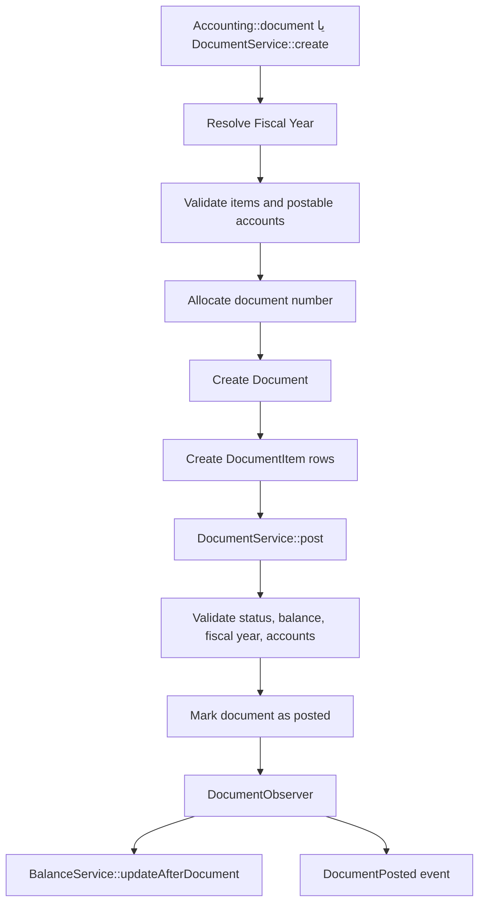
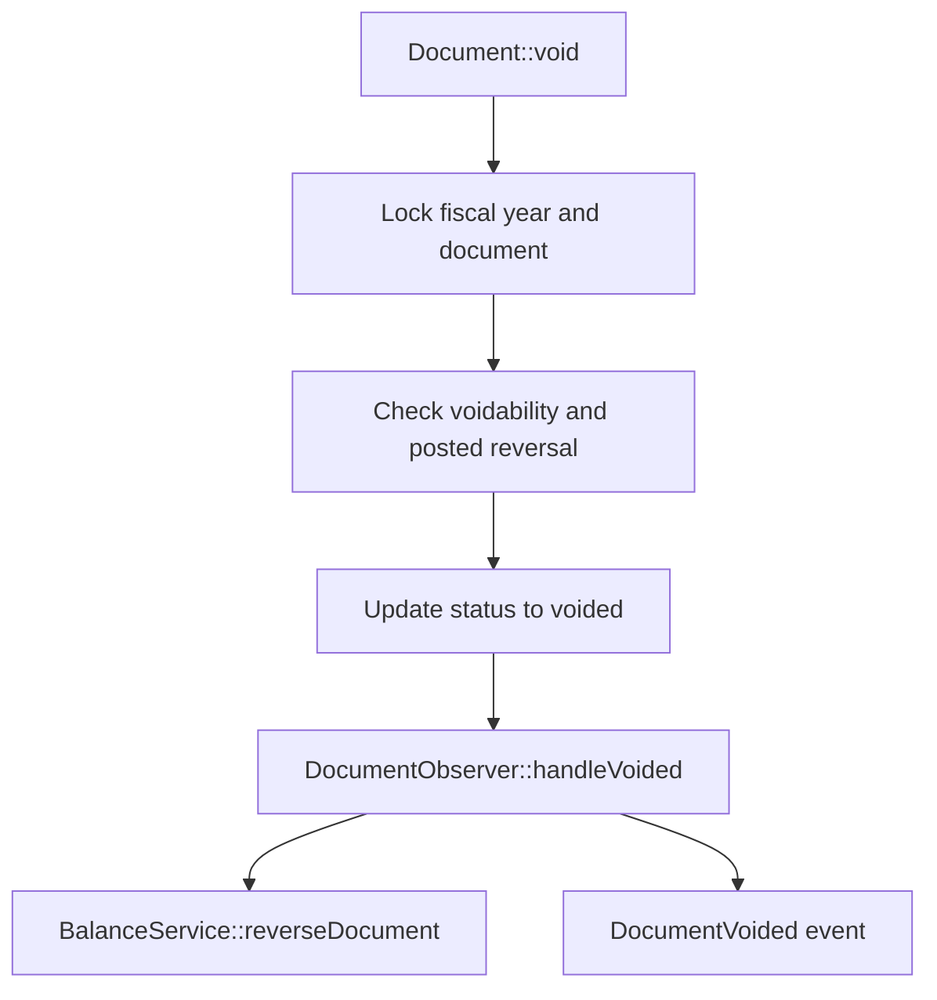
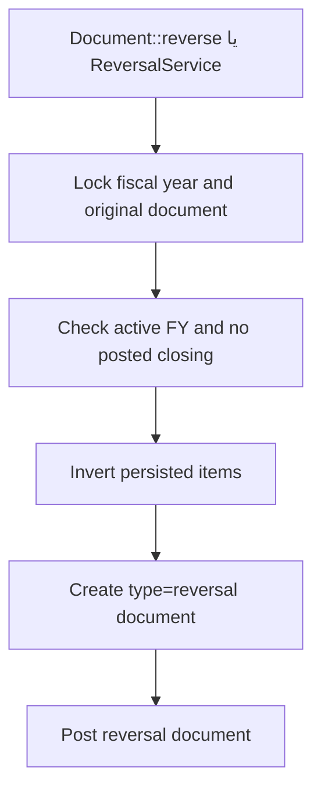
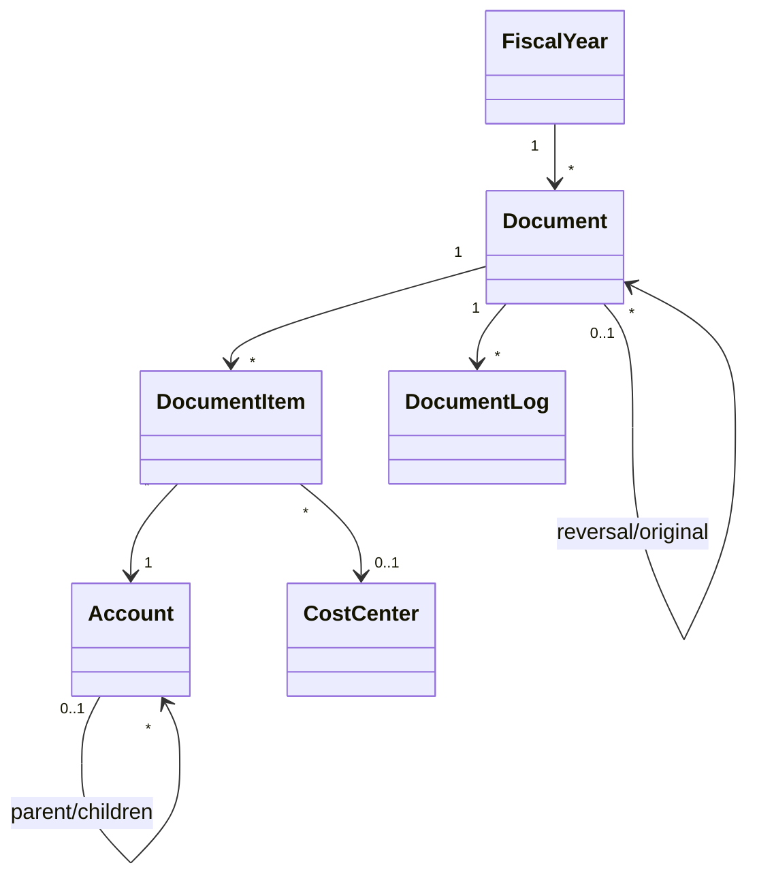

# معماری فنی

## نمای کلی

معماری این پکیج حول سه هسته می‌چرخد:

1. **دفتر حسابداری**: `Document` و `DocumentItem`
2. **ساختار حساب‌ها**: `Account`
3. **کنترل دوره ثبت**: `FiscalYear`، `AccountingPeriod` و `PostingService`

خدمات دیگر مثل افتتاحیه، اختتامیه، برگشت و گزارش‌گیری روی همین سه هسته سوار می‌شوند.

## مرزهای دامنه

### داخل دامنه پکیج

- حساب و ساختار حساب
- سند و ردیف سند
- سال مالی و دوره ثبت
- مانده و گردش
- گزارش‌های ledger-based
- Audit سند

### خارج از دامنه پکیج

- فرآیند فروش، خرید، انبار، CRM
- تعریف مشتری، فروشنده، بانک، صندوق به‌عنوان ماژول مستقل
- UI، کنترلر، API اپلیکیشن
- سیاست‌های دسترسی پروژه

## لایه‌های واقعی

### ۱. Entry Point

- `Accounting` facade
- `AccountingManager`
- `AccountingServiceProvider`

این لایه فقط دسترسی به سرویس‌ها را ساده می‌کند و خودش منطق حسابداری پیچیده ندارد.

### ۲. Application Services

- `AccountService`
- `DocumentService`
- `BalanceService`
- `ReportService`
- `FiscalYearService`
- `AccountingPeriodService`
- `PostingService`
- `OpeningService`
- `ClosingService`
- `ReversalService`
- `DocumentBuilder`

این لایه محل اصلی orchestration و business ruleها است.

### ۳. Domain Model

- `Account`
- `Document`
- `DocumentItem`
- `FiscalYear`
- `AccountingPeriod`
- `CostCenter`
- `DocumentLog`
- `DocumentNumberSequence`
- Enumها و Exceptionها

مدل‌ها بخشی از قواعد را داخل `booted()` و متدهای خود نگه می‌دارند، اما اکثر جریان‌های مهم در سرویس‌ها جمع شده‌اند.

`Karnoweb\Accounting\Support\Amount` نمایش کانونیکال مبلغ است. هر جمع، تفریق، مقایسه یا تست صفر پولی باید از این کلاس بگذرد. محاسبه با PHP float در دامنه حسابداری ممنوع است. جزئیات: [18-monetary-arithmetic.md](18-monetary-arithmetic.md).

### ۴. Persistence / Side Effects

- Migrationها
- `DocumentObserver`
- Cache مربوط به `BalanceService`
- رویدادهای سند و دوره (`DocumentCreated` / `Posted` / `Voided`، `AccountingPeriodOpened` / `Closed`، `PostingRejectedForClosedPeriod`)

## جریان اصلی ثبت سند



## جریان ابطال سند



## جریان برگشت سند



## روابط ماژول‌ها



## مسئولیت هر سرویس

### `AccountService`

- ایجاد حساب
- تولید خودکار کد
- resolve حساب‌های سیستمی
- enforce کردن قواعد سلسله‌مراتب

### `DocumentService`

- ایجاد سند
- تخصیص شماره سند
- validate ردیف‌ها
- validate `idempotency_key`
- ثبت قطعی سند

### `PostingService`

- gate نهایی برای این پرسش: «آیا در این تاریخ و این سال مالی ثبت مجاز است؟»

### `FiscalYearService`

- create / update / activate / close
- کنترل هم‌پوشانی سال‌ها
- کنترل `opening_done`

### `OpeningService`

- ثبت سند افتتاحیه دستی
- انتقال مانده از سال بسته به سال بعد

### `ClosingService`

- صفر کردن حساب‌های موقت
- انتقال سود/زیان خالص به `retained_earnings`

### `ReversalService`

- ساخت سند معکوس برای یک سند posted عملیاتی

### `ReportService`

- ساخت گزارش‌های ledger-based
- حفظ یک foundation مشترک با `LedgerQuery`

## مهم‌ترین Business Ruleها و محل enforce شدن

| قاعده | محل اصلی enforce |
|------|-------------------|
| سند باید متعادل باشد | `DocumentService` |
| ثبت فقط روی حساب قابل‌ثبت | `Account::assertPostable()` و `AccountService` |
| سند posted/voided قابل ویرایش نیست | `Document` و `DocumentItem` |
| هم‌پوشانی سال مالی ممنوع | `FiscalYearService` |
| چند سال `active` فقط وقتی کانفیگ اجازه دهد | `FiscalYearService` |
| ثبت فقط در دوره `open` | `PostingService` / `AccountingPeriodService` |
| گزارش‌ها فقط posted را می‌بینند | `LedgerQuery` |
| افتتاحیه فقط برای حساب‌های دائمی | `OpeningService` |
| اختتامیه فقط برای حساب‌های موقت | `ClosingService` |
| برگشت فقط در همان سال مالی active | `ReversalService` |

## نکات معماری که نباید بدون بررسی تغییر کنند

1. ترتیب گزارش‌ها در `LedgerQuery`، چون روی `runningBalance` اثر مستقیم دارد.
2. قاعده detail-only posting، چون روی همه گزارش‌ها و افتتاحیه/اختتامیه اثر دارد.
3. تفاوت `void` و `reversal`.
4. این اصل که گزارش‌ها از `cached_balance` نمی‌خوانند.
5. این اصل که `PostingService` تنها gate عمومی ثبت است.

جداسازی منطق تجاری از Controller و Model.

| بدون Service | با Service |
|--------------|------------|
| منطق در Controller | Controller فقط HTTP را مدیریت می‌کند |
| تکرار کد | استفاده مجدد از منطق |
| تست سخت | تست آسان |

### ۳.۴ الگوی Observer

واکنش خودکار به تغییرات Model.

| رویداد | واکنش Observer |
|--------|----------------|
| Document created | ثبت در Audit Log |
| Document posted | بروزرسانی مانده حساب‌ها |
| Document voided | برگرداندن مانده حساب‌ها |

### ۳.۵ الگوی Builder

ساخت اسناد پیچیده به صورت مرحله‌ای.

**بدون Builder:**
```php
$document = new Document();
$document->type = 'sale';
$document->date = now();
$document->save();

$item1 = new DocumentItem();
$item1->document_id = $document->id;
$item1->account_id = 1;
$item1->amount = 1000;
$item1->sign = 1;
$item1->save();

// و ادامه...
```

**با Builder:**
```php
Accounting::document()
    ->type('sale')
    ->date(now())
    ->debit($account1, 1000)
    ->credit($account2, 1000)
    ->post();
```

---

## ۴. ساختار پکیج

### ۴.۱ پوشه‌بندی اصلی

| پوشه | محتوا |
|------|-------|
| src/Models | Account, FiscalYear, AccountingPeriod, Document, DocumentItem, DocumentLog, DocumentNumberSequence, CostCenter, Branch, BaseModel |
| src/Services | Account, Document, DocumentBuilder, Balance, Report, FiscalYear, AccountingPeriod, Posting, Opening, Closing, Reversal |
| src/Reporting | LedgerQuery و DTOهای گزارش |
| src/Support | Amount, AccountHierarchy, BranchContext |
| src/Enums | AccountType, AccountNature, DocumentStatus, FiscalYearStatus, AccountingPeriodStatus, AuditAction |
| src/Events | DocumentCreated/Posted/Voided + سه رویداد دوره |
| src/Observers | DocumentObserver |
| src/Exceptions | استثناهای دامنه (۱۷ کلاس) |
| database/migrations | ۱۱ فایل شامل دوره‌ها و ایندکس گزارش |

### ۴.۲ جزئیات پوشه Models

| فایل | مسئولیت |
|------|---------|
| Account.php | مدل حساب |
| Document.php | مدل سند |
| DocumentItem.php | مدل آیتم سند |
| DocumentLog.php | مدل لاگ تغییرات |
| FiscalYear.php | مدل سال مالی |
| AccountingPeriod.php | دوره ثبت داخل سال مالی |
| DocumentNumberSequence.php | توالی شماره سند |
| Branch.php | مدل اختیاری شعبه اپ |
| CostCenter.php | مدل مرکز هزینه |

### ۴.۳ جزئیات پوشه Services

| فایل | مسئولیت |
|------|---------|
| AccountService.php | ایجاد و جستجوی حساب |
| DocumentService.php | create / post / شماره / تعادل |
| DocumentBuilder.php | API زنجیره‌ای سند |
| BalanceService.php | مانده، گردش، کش |
| ReportService.php | گزارش‌های ledger-based |
| FiscalYearService.php | چرخه سال مالی (بدون ساخت ژورنال افتتاح/اختتام) |
| AccountingPeriodService.php | چرخه دوره ثبت |
| PostingService.php | gate FY + period |
| OpeningService.php | افتتاحیه |
| ClosingService.php | بستن سود و زیان |
| ReversalService.php | برگشت عملیاتی |

### ۴.۴ جزئیات پوشه Enums

| فایل | مقادیر |
|------|--------|
| AccountType.php | asset, liability, equity, income, expense |
| AccountNature.php | debit, credit |
| DocumentStatus.php | draft, pending, approved, posted, voided |
| FiscalYearStatus.php | draft, active, closed |
| AccountingPeriodStatus.php | draft, open, closed |
| AuditAction.php | created, updated, submitted, approved, rejected, posted, voided, restored |

### ۴.۵ جزئیات پوشه Events

| فایل | زمان Fire شدن |
|------|---------------|
| DocumentCreated.php | پس از ایجاد سند |
| DocumentPosted.php | پس از ثبت قطعی سند |
| DocumentVoided.php | پس از ابطال سند |
| AccountingPeriodOpened.php | پس از باز شدن دوره |
| AccountingPeriodClosed.php | پس از بسته شدن دوره |
| PostingRejectedForClosedPeriod.php | رد ثبت به‌خاطر دوره |

### ۴.۶ جزئیات پوشه Exceptions

| فایل | زمان پرتاب |
|------|------------|
| UnbalancedDocumentException.php | سند بالانس نیست |
| ClosedFiscalYearException.php | ثبت در سال مالی بسته |
| ClosedAccountingPeriodException.php | ثبت در دوره بسته |
| InactiveAccountException.php | استفاده از حساب غیرفعال |

---

## ۵. جریان داده‌ها

### ۵.۱ جریان ثبت سند

| مرحله | عملیات | مسئول |
|-------|--------|-------|
| ۱ | دریافت درخواست | Controller/Facade |
| ۲ | اعتبارسنجی داده‌ها | DocumentService |
| ۳ | بررسی سال مالی و دوره باز | PostingService |
| ۴ | بررسی حساب‌ها | AccountService |
| ۵ | بررسی بالانس | DocumentService |
| ۶ | ذخیره سند | Document Model |
| ۷ | ذخیره آیتم‌ها | DocumentItem Model |
| ۸ | ثبت لاگ | DocumentObserver |
| ۹ | Fire رویداد | Event System |
| ۱۰ | بروزرسانی مانده | BalanceService |

### ۵.۲ جریان دریافت مانده

| مرحله | عملیات | مسئول |
|-------|--------|-------|
| ۱ | درخواست مانده | Facade/Service |
| ۲ | بررسی Cache | BalanceService |
| ۳a | اگر Cache معتبر | برگرداندن مقدار Cache |
| ۳b | اگر Cache نامعتبر | محاسبه از دیتابیس |
| ۴ | بروزرسانی Cache | BalanceService |
| ۵ | برگرداندن نتیجه | BalanceService |

### ۵.۳ جریان تولید گزارش

| مرحله | عملیات | مسئول |
|-------|--------|-------|
| ۱ | دریافت پارامترها | Controller/Facade |
| ۲ | اعتبارسنجی بازه | ReportService |
| ۳ | واکشی داده‌ها | Account/Document Models |
| ۴ | محاسبات | ReportService |
| ۵ | قالب‌بندی خروجی | ReportService |
| ۶ | برگرداندن نتیجه | Controller/Facade |

---

## ۶. ارتباط با پروژه

### ۶.۱ روش‌های اتصال

| روش | کاربرد | پیچیدگی |
|-----|--------|---------|
| HasAccount Trait | اتصال Model به حساب | ساده |
| Facade | استفاده مستقیم از API | ساده |
| Service Injection | تزریق سرویس در کلاس | متوسط |
| Event Listening | واکنش به رویدادهای پکیج | متوسط |

### ۶.۲ HasAccount Trait

برای مدل‌هایی که نیاز به حساب دارند.

| قابلیت | شرح |
|--------|-----|
| ساخت خودکار حساب | هنگام ایجاد Model |
| دسترسی به حساب | `$model->account` |
| دسترسی به مانده | `$model->balance()` |
| دسترسی به اسناد | `$model->documents()` |

### ۶.۳ Facade

استفاده سریع بدون نیاز به تزریق.

| متد | کاربرد |
|-----|--------|
| `Accounting::document()` | ساخت سند جدید |
| `Accounting::balance($account)` | دریافت مانده |
| `Accounting::report()` | تولید گزارش |
| `Accounting::account()` | مدیریت حساب |

### ۶.۴ Event Listening

پروژه می‌تواند به رویدادهای پکیج گوش دهد.

| رویداد | کاربرد در پروژه |
|--------|-----------------|
| DocumentPosted | ارسال اعلان، بروزرسانی داشبورد |
| DocumentVoided | ارسال هشدار، لاگ خاص |

---

## ۷. سیستم رویداد (Event System)

### ۷.۱ رویدادهای پکیج

| رویداد | Payload | زمان |
|--------|---------|------|
| DocumentCreated | Document | پس از ایجاد |
| DocumentPosted | Document | پس از ثبت قطعی |
| DocumentVoided | Document, reason | پس از ابطال |

### ۷.۲ نحوه استفاده در پروژه

پروژه می‌تواند Listener برای این رویدادها بسازد:

| رویداد | Listener پروژه | عملیات |
|--------|----------------|--------|
| DocumentPosted | SendInvoiceEmail | ارسال فاکتور ایمیلی |
| DocumentPosted | UpdateDashboard | بروزرسانی آمار |
| DocumentVoided | NotifyManager | اطلاع به مدیر |

---

## ۸. مدیریت خطا

### ۸.۱ انواع Exception

| Exception | علت | HTTP Code |
|-----------|-----|-----------|
| UnbalancedDocumentException | مجموع بدهکار ≠ مجموع بستانکار | 422 |
| ClosedFiscalYearException | سال مالی بسته است | 422 |
| InactiveAccountException | حساب غیرفعال است | 422 |
| ClosedAccountingPeriodException | دوره بسته است | 422 |
| AccountNotFoundException | حساب یافت نشد | 404 |

### ۸.۲ مدیریت در پروژه

پروژه می‌تواند این Exception ها را در Handler مدیریت کند:

| Exception | پاسخ پیشنهادی |
|-----------|---------------|
| UnbalancedDocumentException | نمایش خطا به کاربر |
| ClosedFiscalYearException | راهنمایی به سال جدید |
| InactiveAccountException | پیشنهاد فعال‌سازی |

---

## ۹. استراتژی Cache

### ۹.۱ چرا Cache؟

محاسبه مانده از روی اسناد در مقیاس بزرگ کند است.

| تعداد تراکنش | زمان محاسبه بدون Cache | زمان با Cache |
|--------------|------------------------|---------------|
| ۱,۰۰۰ | ~۵۰ms | ~۱ms |
| ۱۰,۰۰۰ | ~۵۰۰ms | ~۱ms |
| ۱۰۰,۰۰۰ | ~۵s | ~۱ms |

### ۹.۲ استراتژی بروزرسانی

| روش | زمان اجرا | دقت |
|-----|-----------|-----|
| Immediate | پس از هر سند posted/voided از طریق `DocumentObserver` | پیاده‌سازی فعلی |
| Delayed / Scheduled | در `config.balance.update_strategy` رزرو شده‌اند | **اجرا نمی‌شوند** |

💡 **توصیه:** از روش Immediate برای دقت بالا استفاده کنید.

### ۹.۳ محل ذخیره Cache

| محل | مزیت | معایب |
|-----|------|-------|
| فیلد در جدول accounts | ساده، Atomic | فضای بیشتر |
| Redis/Memcached | سریع‌تر | پیچیدگی بیشتر |

💡 **توصیه:** فیلد در جدول برای اکثر پروژه‌ها کافی است.

---

## ۱۰. Multi-tenancy

### ۱۰.۱ پشتیبانی

پکیج از Multi-tenancy پشتیبانی می‌کند.

| روش | پشتیبانی |
|-----|----------|
| Branch-based | ✅ بله |
| Database per tenant | ⚠️ نیاز به Config |
| Schema per tenant | ⚠️ نیاز به Config |

### ۱۰.۲ Branch-based Multi-tenancy

ساده‌ترین روش که در پکیج پیاده‌سازی شده:

| جنبه | شرح |
|------|-----|
| یک دیتابیس | همه شعب در یک DB |
| فیلتر با Branch | هر Query بر اساس branch_id |
| گزارش جداگانه | هر شعبه گزارش خودش |
| گزارش تجمیعی | امکان ترکیب همه شعب |

---

## ۱۱. قابلیت توسعه

### قانون مبلغ‌ها

Monetary accounting calculations must never use PHP floating-point arithmetic.

برای مبلغ جدید، `Amount::of()` / `add()` / `subtract()` / `equals()` / `isZero()` را استفاده کنید. `bcadd` را در سرویس‌ها پخش نکنید.

### ۱۱.۱ افزودن نوع سند جدید

پروژه می‌تواند انواع سند جدید تعریف کند:

| مرحله | عملیات |
|-------|--------|
| ۱ | افزودن به Config |
| ۲ | ساخت Service مختص (اختیاری) |
| ۳ | استفاده از نوع جدید |

### ۱۱.۲ افزودن گزارش جدید

| مرحله | عملیات |
|-------|--------|
| ۱ | ساخت کلاس Report |
| ۲ | استفاده از ReportService |
| ۳ | قالب‌بندی خروجی |

### ۱۱.۳ توسعه از طریق رویداد و سرویس

سرویس‌ها Macroable نیستند. توسعهٔ مورد انتظار از طریق رویدادها، سرویس‌های عمومی Facade، و پیاده‌سازی workflow در اپ میزبان است.

---

## ۱۲. نکات امنیتی

### ۱۲.۱ محافظت‌های داخلی

| محافظت | شرح |
|--------|-----|
| بالانس اجباری | سند نامتعادل ثبت نمی‌شود |
| سال مالی بسته | ثبت در دوره بسته ممنوع |
| حساب سیستمی | حذف حساب‌های پایه ممنوع |
| Audit Trail | ثبت تمام تغییرات |

### ۱۲.۲ مسئولیت پروژه

| مسئولیت | شرح |
|---------|-----|
| Authorization | چه کسی می‌تواند سند ثبت کند |
| Authentication | شناسایی کاربر |
| Input Validation | اعتبارسنجی ورودی‌های UI |

---

## ۱۳. خلاصه

| جنبه | رویکرد |
|------|--------|
| معماری | لایه‌ای (Layered) |
| الگوهای اصلی | Facade, Service, Observer, Builder |
| ارتباط با پروژه | Trait, Facade, Events |
| مدیریت خطا | Exception های سفارشی |
| Performance | Cache مانده در دیتابیس |
| توسعه‌پذیری | Config (کلیدهای enforce‌شده), Events, سرویس‌های عمومی |

---

[→ ادامه: ساختار دیتابیس (04-database-schema.md)](04-database-schema.md)

[← بازگشت: مفاهیم حسابداری (02-concepts.md)](02-concepts.md)

[⌂ فهرست (00-index.md)](00-index.md)